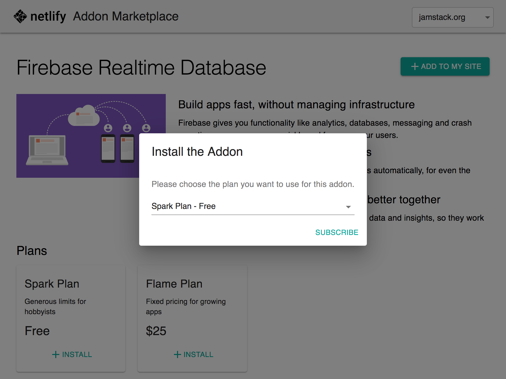

# Proof of concept: Netlify Add-on Marketplace

**Dogfooding the JAMstack**

Since there were ideas around having more third party add-ons for Netlify sites but the options around billing them via the Bitballoon API might be complicated this proposal should outline a JAMstacky solution.

The idea is based around taking away responsibilities from the monolithic Bitballoon API and dogfooding some services which users are supposed to use for these kinds of problems. For the long run I'm proposing to take auth and billing away from Bitballoon entirely.

There are definitely some changes needed to make those services able to handle teams and subscriptions properly and I hope to point out those using this setup.



## The Stack

- **Static site** for presentation of add-ons and their plans
- **GoCommerce** - Payment handling
- **GoTrue** / Netlify Identity - User management
- Add-on (de-)provisioning via cloud functions called from GoCommerce webhook

## Typical flow

- A user visits the add-on marketplace
- They choose a site from the site drop-down
- They select an add-on they want to enable
- From the add-on detail page they pick a plan
- They install the plan and get forwarded to the payment provider
- After the successful subscription payment setup the add-on is provisioned
- The user gets a notification saying the add-on is read to use
- They connect to the add-on via an environment variable

## Implementation

### GoCommerce ([#178](https://github.com/netlify/gocommerce/pull/178))

[Prepared a draft PR](https://github.com/netlify/gocommerce/pull/178) to allow creating subscriptions for users (needs JWT) in GoCommerce. This uses `.gocommerce-service` for obtaining metadata from the static site.

This should be able to leverage the subscription capabilities of Stripe and PayPal by creating a plan according to the add-on subscription and prompting the user to agree to a regular subscription. The plan details can be taken from the add-on metadata obtained from the static site. This way providers will generate correct receipts.

- [Stripe subscription docs](https://stripe.com/docs/billing/subscriptions/examples)
- [Paypal subscription docs](https://developer.paypal.com/docs/subscriptions/)

Add-ons are supposed to store details about the connected instance in the subscription metadata in GoCommerce. They will need a token for that.

GoTrue might need to be able to allow multiple users access to subscriptions of a team account. (In connection to team support in GoTrue.)

### GoTrue ([#210](https://github.com/netlify/gotrue/pull/210))

[Prepared a draft PR](https://github.com/netlify/gotrue/pull/210) to allow logging in via Netlify OAuth2. To be able to access the netlify API the access token is stored encrypted inside the JWT.

This is supposed to be a workaround until the Netlify API uses GoTrue internally.

Handling teams in GoTrue is a requirement for using GoTrue in multiuser team setups.

### API proxy

Cloud function allowing access to the Netlify API via a JWT containing an encrypted access token

### Static site

Gatsby site showing available add-ons based on markdown files inside the repository. Also renders metadata for add-on plans on detail pages.

#### Example

```markdown
---
title: "Firebase Realtime Database"
name: firebase-rtdb
logo: ./firebase-logo.svg
banner: ./firebase-banner.png
plans:
  - name: Spark Plan
    description: "Generous limits for hobbyists"
    price: 0
  - name: Flame Plan
    description: "Fixed pricing for growing apps"
    price: 25
    interval: 1 month
---

#### Build apps fast, without managing infrastructure

Firebase gives you functionality like analytics, databases, messaging and crash reporting so you can move quickly and focus on your users.
```

This can easily be managed using netlify CMS and third party vendors might be able to make a PR to propose or update their add-ons.

### Firebase example provisioner

Cloud function using the automated Firebase project creation capabilities of the Firebase SDK.

Users can be given access to the Firebase project after logging in with their Google account. Since RBAC in GCP is powerful this can be done without giving away control of plan level or billing info.
